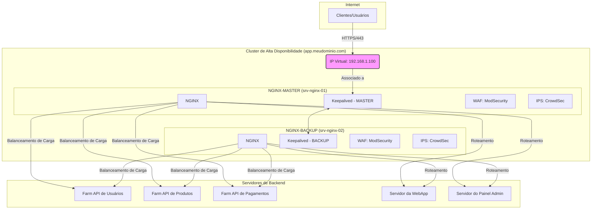

Excelente\! Esta é uma tarefa abrangente e muito relevante para ambientes de produção modernos. Como especialista em administração de sistemas Linux, NGINX e segurança, preparei um guia detalhado e completo para atender a todos os seus requisitos.

Vamos construir um cluster de Application Gateway robusto, seguro e de alta disponibilidade no Ubuntu 24.04 LTS.

-----

### **Guia Completo: Cluster NGINX com Keepalived como Application Gateway L7 no Ubuntu 24.04 LTS**

Este guia detalha a criação de um cluster de dois nós (ativo-passivo) usando NGINX e Keepalived. Ele funcionará como um gateway de aplicação Layer 7, distribuindo tráfego para múltiplos serviços de backend, com foco em segurança, alta disponibilidade e escalabilidade.

### **1. Diagrama da Infraestrutura (Mermaid)**

Este diagrama representa a arquitetura final. O VIP (Virtual IP) é o ponto de entrada único para os clientes, e o Keepalived garante que ele esteja sempre atribuído a um nó NGINX funcional.



### **2. Documentação do Projeto**

**Componentes e Funções:**

  * **Ubuntu 24.04 LTS:** A base do nosso sistema operacional. É uma versão Long-Term Support, garantindo estabilidade e atualizações de segurança por um longo período.
  * **NGINX (Community Edition):** Atua como o núcleo do nosso Application Gateway. Ele é responsável por:
      * **Terminação SSL/TLS:** Descriptografa o tráfego HTTPS dos clientes.
      * **Balanceamento de Carga (Load Balancing):** Distribui as requisições entre os servidores de backend usando o método `least_conn` (menos conexões), que envia novas requisições para o servidor com o menor número de conexões ativas.
      * **Roteamento Layer 7:** Direciona o tráfego com base na URL (`location`) para diferentes grupos de servidores (`upstream`).
      * **Persistência de Sessão (Session Persistence):** Utiliza `sticky cookies` para garantir que um cliente seja direcionado para o mesmo servidor de backend durante sua sessão.
      * **Failover e Fallback:** Detecta servidores de backend offline (`max_fails`) e os remove temporariamente do pool. Servidores de `backup` podem ser ativados caso todos os primários falhem.
      * **Monitoramento de Status:** O módulo `stub_status` oferece métricas básicas sobre o desempenho do NGINX.
  * **Keepalived:** Garante a alta disponibilidade (HA) do serviço.
      * **Virtual IP (VIP):** Gerencia um endereço IP flutuante. Este IP é o único ponto de contato para os clientes.
      * **VRRP (Virtual Router Redundancy Protocol):** Comunica-se com o outro nó para decidir quem será o `MASTER` (ativo) e quem será o `BACKUP` (passivo).
      * **Health Check:** Monitora o processo do NGINX. Se o NGINX falhar no nó `MASTER`, o Keepalived automaticamente move o VIP para o nó `BACKUP`, que assume o tráfego em segundos.
  * **ModSecurity (com OWASP CRS):** Atua como um Web Application Firewall (WAF), protegendo contra ataques comuns como SQL Injection, Cross-Site Scripting (XSS), e outros listados no OWASP Top 10.
  * **CrowdSec:** É um sistema de detecção e prevenção de intrusão (IDS/IPS) colaborativo e baseado em comportamento. Ele analisa logs em tempo real, detecta comportamento malicioso (ex: tentativas de brute-force, scans de portas) e bloqueia os IPs agressores em nível de firewall, compartilhando a reputação desses IPs com uma rede global.

### **3. Pré-requisitos**

1.  **Dois Servidores:** `srv-nginx-01` (MASTER) e `srv-nginx-02` (BACKUP) com Ubuntu 24.04 LTS instalado.
2.  **IPs Estáticos:** Configure IPs estáticos em ambos os servidores. Exemplo: `srv-nginx-01` (192.168.1.10) e `srv-nginx-02` (192.168.1.11).
3.  **Certificado SSL:** Você precisa de um arquivo de certificado no formato PEM (`.pem`) e a chave privada (`.key`). Como ele é protegido por senha, tenha a senha em mãos.
4.  **DNS:** O registro DNS `app.meudominio.com` deve apontar para o VIP que será configurado (ex: `192.168.1.100`).

-----

### **4. Instalação e Configuração (Execute em ambos os servidores)**

#### **Passo 1: Atualização do Sistema**

```bash
sudo apt update && sudo apt upgrade -y
```

#### **Passo 2: Instalação do NGINX, Keepalived e Ferramentas**

```bash
sudo apt install -y nginx keepalived curl git
```

#### **Passo 3: Instalação do ModSecurity v3 (Módulo NGINX)**

O Ubuntu 24.04 facilita a instalação do conector ModSecurity para NGINX.

```bash
# Instala a biblioteca principal e o conector dinâmico para NGINX
sudo apt install -y libmodsecurity3 libnginx-mod-modsecurity

# Cria o diretório de configuração
sudo mkdir /etc/nginx/modsecurity/
```

#### **Passo 4: Instalação do OWASP Core Rule Set (CRS)**

```bash
# Clona as regras do repositório oficial
sudo git clone https://github.com/coreruleset/coreruleset /usr/share/modsecurity-crs

# Cria os arquivos de configuração a partir dos exemplos
sudo cp /usr/share/modsecurity-crs/crs-setup.conf.example /usr/share/modsecurity-crs/crs-setup.conf
sudo cp /usr/share/modsecurity-crs/rules/REQUEST-900-EXCLUSION-RULES-BEFORE-CRS.conf.example /usr/share/modsecurity-crs/rules/REQUEST-900-EXCLUSION-RULES-BEFORE-CRS.conf
```

#### **Passo 5: Preparar o Certificado SSL**

1.  Copie seu certificado e chave para um diretório seguro:
    ```bash
    sudo mkdir -p /etc/nginx/ssl
    sudo cp /caminho/para/seu/certificado.pem /etc/nginx/ssl/app.meudominio.com.pem
    sudo cp /caminho/para/sua/chave.key /etc/nginx/ssl/app.meudominio.com.key
    ```
2.  Crie um arquivo com a senha do certificado:
    ```bash
    echo "SUA_SENHA_DO_CERTIFICADO" | sudo tee /etc/nginx/ssl/cert_password.txt
    ```
3.  Ajuste as permissões para proteger os arquivos:
    ```bash
    sudo chmod 600 /etc/nginx/ssl/*
    sudo chown root:root /etc/nginx/ssl/*
    ```

-----

### **5. Configuração do NGINX**

#### **Arquivo Principal: `/etc/nginx/nginx.conf`**

Substitua o conteúdo de `/etc/nginx/nginx.conf` pelo abaixo. Ele carrega o módulo ModSecurity e otimiza as configurações gerais.

```nginx
# Define o usuário que o NGINX usará.
user www-data;

# O número de processos de trabalho deve ser igual ao número de núcleos da CPU. 'auto' faz isso automaticamente.
worker_processes auto;

# Arquivo para armazenar o ID do processo principal.
pid /run/nginx.pid;

# Carrega o módulo dinâmico do ModSecurity. Essencial para o WAF.
load_module modules/ngx_http_modsecurity_module.so;

# Inclui arquivos de configuração de módulos, se houver.
include /etc/nginx/modules-enabled/*.conf;

events {
    # Número máximo de conexões simultâneas por processo de trabalho.
    worker_connections 2048;
    # Permite que um worker aceite múltiplas conexões de uma vez. Otimização de performance.
    multi_accept on;
}

http {
    ##
    # Configurações Básicas
    ##

    sendfile on;
    tcp_nopush on;
    tcp_nodelay on;
    keepalive_timeout 65;
    types_hash_max_size 2048;
    server_tokens off; # Oculta a versão do NGINX por segurança.

    # Tamanho máximo do corpo da requisição. Ajuste conforme necessário.
    client_max_body_size 50M;

    include /etc/nginx/mime.types;
    default_type application/octet-stream;

    ##
    # Configurações de SSL
    ##
    ssl_protocols TLSv1.2 TLSv1.3; # Protocolos seguros
    ssl_prefer_server_ciphers on;
    ssl_ciphers 'ECDHE-ECDSA-AES128-GCM-SHA256:ECDHE-RSA-AES128-GCM-SHA256:ECDHE-ECDSA-AES256-GCM-SHA384:ECDHE-RSA-AES256-GCM-SHA384:DHE-RSA-AES128-GCM-SHA256:DHE-RSA-AES256-GCM-SHA384';
    ssl_session_cache shared:SSL:10m;
    ssl_session_timeout 10m;

    ##
    # Configurações de Log
    ##
    access_log /var/log/nginx/access.log;
    error_log /var/log/nginx/error.log;

    ##
    # Gzip
    ##
    gzip on;
    gzip_disable "msie6";

    ##
    # Inclusão de Configurações Virtuais
    # Todos os nossos sites/listeners ficarão em /etc/nginx/conf.d/
    ##
    include /etc/nginx/conf.d/*.conf;
    include /etc/nginx/sites-enabled/*; # Mantém compatibilidade com o padrão Ubuntu
}
```

#### **Arquivo de Configuração do WAF: `/etc/nginx/modsecurity/modsecurity.conf`**

Este arquivo habilita e configura o ModSecurity.

```ini
# Conteúdo para /etc/nginx/modsecurity/modsecurity.conf
# Diretiva principal para habilitar o motor do ModSecurity.
# Pode ser On, Off, ou DetectionOnly (apenas loga, não bloqueia).
# Iniciaremos com 'On' para proteção ativa.
SecRuleEngine On

# Define o arquivo de log de auditoria.
SecAuditLog /var/log/nginx/modsec_audit.log

# Define quais partes da transação serão logadas.
SecAuditLogParts ABCIJDEFHZ

# Define o formato do log de auditoria.
SecAuditLogType Serial

# Define o diretório para arquivos temporários e uploads.
SecTmpDir /tmp/
SecUploadDir /tmp/
```

#### **Arquivo do Listener: `/etc/nginx/conf.d/app.meudominio.com.conf`**

Este é o coração da nossa configuração de gateway de aplicação.

```nginx
# /etc/nginx/conf.d/app.meudominio.com.conf

# --- Upstreams (Grupos de Servidores Backend) ---

# Endpoint: /api/users/*
# Método: least_conn (Menos Conexões)
# Persistência: sticky cookie (o cookie 'srv_id' manterá a sessão)
upstream backend_api_users {
    least_conn;
    # Define um cookie chamado 'srv_id' para persistência.
    # expires=1h: o cookie dura 1 hora.
    # httponly: o cookie não pode ser acessado por JavaScript.
    # secure: o cookie só é enviado em HTTPS.
    # samesite=strict: proteção contra CSRF.
    sticky cookie srv_id expires=1h httponly secure samesite=strict;

    server 10.0.0.1:8081 weight=10 max_fails=3 fail_timeout=30s; # Servidor 1
    server 10.0.0.2:8081 weight=10 max_fails=3 fail_timeout=30s; # Servidor 2
}

# Endpoint: /api/products/*
upstream backend_api_products {
    least_conn;
    sticky cookie srv_id expires=1h httponly secure samesite=strict;

    server 10.0.0.3:8082 weight=10 max_fails=3 fail_timeout=30s;
    server 10.0.0.4:8082 weight=5; # Este servidor recebe metade do tráfego do outro.
    server 10.0.0.99:8082 backup; # Servidor de fallback, usado apenas se os outros falharem.
}

# Endpoint: /api/payments/* (apenas um servidor neste exemplo)
upstream backend_api_payments {
    server 10.0.0.5:8083;
}

# Endpoint: /webapp/*
upstream backend_webapp {
    server 10.0.0.6:80;
}

# Endpoint: /admin/*
upstream backend_admin_panel {
    server 10.0.0.7:8888;
}

# --- Servidor Virtual (Listener Principal) ---

server {
    listen 80;
    server_name app.meudominio.com;
    # Redireciona todo o tráfego HTTP para HTTPS
    return 301 https://$host$request_uri;
}

server {
    listen 443 ssl http2;
    server_name app.meudominio.com;

    # --- Configurações de SSL ---
    ssl_certificate /etc/nginx/ssl/app.meudominio.com.pem;
    ssl_certificate_key /etc/nginx/ssl/app.meudominio.com.key;
    # Arquivo com a senha da chave privada
    ssl_password_file /etc/nginx/ssl/cert_password.txt;

    # --- Configurações de Segurança e WAF ---
    # Habilita o ModSecurity para este servidor virtual.
    modsecurity on;
    # Carrega as regras do ModSecurity e do OWASP CRS.
    modsecurity_rules_file /etc/nginx/modsecurity/main.conf;


    # --- Roteamento de Endpoints (Locations) ---

    location /api/users/ {
        proxy_pass http://backend_api_users;
        include /etc/nginx/proxy_params;
    }

    location /api/products/ {
        proxy_pass http://backend_api_products;
        include /etc/nginx/proxy_params;
    }

    location /api/payments/ {
        proxy_pass http://backend_api_payments;
        include /etc/nginx/proxy_params;
    }

    location /webapp/ {
        proxy_pass http://backend_webapp;
        include /etc/nginx/proxy_params;
    }

    location /admin/ {
        # Exemplo de restrição de acesso por IP para um endpoint sensível
        # allow 1.2.3.4; # IP do escritório
        # deny all;
        proxy_pass http://backend_admin_panel;
        include /etc/nginx/proxy_params;
    }

    # --- Monitoramento de Status (stub_status) ---
    location /nginx_status {
        stub_status;
        allow 127.0.0.1; # Permite acesso local
        allow 192.168.1.0/24; # Permite acesso da rede de gerenciamento
        deny all; # Bloqueia todos os outros
    }

    # Redirecionamento para a WebApp como padrão
    location / {
        return 302 /webapp/;
    }
}
```

#### **Arquivo de Inclusão de Regras WAF: `/etc/nginx/modsecurity/main.conf`**

Crie este arquivo para carregar as regras do OWASP CRS de forma organizada.

```nginx
# /etc/nginx/modsecurity/main.conf

# Carrega a configuração principal do ModSecurity
include /etc/nginx/modsecurity/modsecurity.conf;

# Carrega o arquivo de setup do OWASP CRS
include /usr/share/modsecurity-crs/crs-setup.conf;

# Carrega as regras do OWASP CRS
include /usr/share/modsecurity-crs/rules/REQUEST-901-INITIALIZATION.conf;
include /usr/share/modsecurity-crs/rules/REQUEST-903.9001-DRUPAL-EXCLUSION-RULES.conf;
include /usr/share/modsecurity-crs/rules/REQUEST-903.9002-WORDPRESS-EXCLUSION-RULES.conf;
include /usr/share/modsecurity-crs/rules/REQUEST-905-COMMON-EXCEPTIONS.conf;
include /usr/share/modsecurity-crs/rules/REQUEST-910-IP-REPUTATION.conf;
include /usr/share/modsecurity-crs/rules/REQUEST-911-METHOD-ENFORCEMENT.conf;
include /usr/share/modsecurity-crs/rules/REQUEST-912-DOS-PROTECTION.conf;
include /usr/share/modsecurity-crs/rules/REQUEST-913-SCANNER-DETECTION.conf;
include /usr/share/modsecurity-crs/rules/REQUEST-920-PROTOCOL-ENFORCEMENT.conf;
include /usr/share/modsecurity-crs/rules/REQUEST-921-PROTOCOL-ATTACK.conf;
include /usr/share/modsecurity-crs/rules/REQUEST-930-APPLICATION-ATTACK-LFI.conf;
include /usr/share/modsecurity-crs/rules/REQUEST-931-APPLICATION-ATTACK-RFI.conf;
include /usr/share/modsecurity-crs/rules/REQUEST-932-APPLICATION-ATTACK-RCE.conf;
include /usr/share/modsecurity-crs/rules/REQUEST-933-APPLICATION-ATTACK-PHP.conf;
include /usr/share/modsecurity-crs/rules/REQUEST-934-APPLICATION-ATTACK-NODEJS.conf;
include /usr/share/modsecurity-crs/rules/REQUEST-941-APPLICATION-ATTACK-XSS.conf;
include /usr/share/modsecurity-crs/rules/REQUEST-942-APPLICATION-ATTACK-SQLI.conf;
include /usr/share/modsecurity-crs/rules/REQUEST-943-APPLICATION-ATTACK-SESSION-FIXATION.conf;
include /usr/share/modsecurity-crs/rules/REQUEST-944-APPLICATION-ATTACK-JAVA.conf;
include /usr/share/modsecurity-crs/rules/REQUEST-949-BLOCKING-EVALUATION.conf;
include /usr/share/modsecurity-crs/rules/RESPONSE-950-DATA-LEAKAGES.conf;
include /usr/share/modsecurity-crs/rules/RESPONSE-951-DATA-LEAKAGES-SQL.conf;
include /usr/share/modsecurity-crs/rules/RESPONSE-952-DATA-LEAKAGES-JAVA.conf;
include /usr/share/modsecurity-crs/rules/RESPONSE-953-DATA-LEAKAGES-PHP.conf;
include /usr/share/modsecurity-crs/rules/RESPONSE-954-DATA-LEAKAGES-IIS.conf;
include /usr/share/modsecurity-crs/rules/RESPONSE-959-BLOCKING-EVALUATION.conf;
include /usr/share/modsecurity-crs/rules/RESPONSE-980-CORRELATION.conf;
```

-----

### **6. Configuração do Keepalived para Alta Disponibilidade (HA)**

#### **Passo 1: Criar o Script de Verificação do NGINX**

Este script verifica se o processo NGINX está ativo. Se não estiver, o Keepalived iniciará o processo de failover.

Crie o arquivo `/etc/keepalived/check_nginx.sh`:

```bash
#!/bin/bash
if pgrep nginx > /dev/null; then
    exit 0 # NGINX está rodando
else
    exit 1 # NGINX não está rodando
fi
```

Dê permissão de execução:

```bash
sudo chmod +x /etc/keepalived/check_nginx.sh
```

#### **Passo 2: Configurar o Keepalived**

**No servidor MASTER (`srv-nginx-01`):**

Edite `/etc/keepalived/keepalived.conf`:

```conf
# /etc/keepalived/keepalived.conf - MASTER

global_defs {
   # Identificação do roteador. Use o hostname para clareza.
   router_id NGINX_MASTER
}

# Script para verificar o status do NGINX
vrrp_script check_nginx {
    script "/etc/keepalived/check_nginx.sh"
    interval 2  # Verificar a cada 2 segundos
    weight 20   # Se o script falhar, subtrai 20 da prioridade
}

# Instância do VRRP para o nosso VIP
vrrp_instance VI_1 {
    state MASTER            # Este é o servidor principal
    interface ens160        # SUBSTITUA pelo nome da sua interface de rede (ex: eth0, ens33)
    virtual_router_id 51    # ID único para este grupo VRRP (deve ser o mesmo em ambos os nós)
    priority 150            # Prioridade. O nó com maior prioridade se torna MASTER.
    
    # Notificação de mudança de estado. Útil para logs ou alertas.
    notify_master "/bin/echo 'Tornando-se MASTER' > /var/log/keepalived.log"
    notify_backup "/bin/echo 'Tornando-se BACKUP' > /var/log/keepalived.log"
    notify_fault "/bin/echo 'Estado de FALHA' > /var/log/keepalived.log"

    # O endereço IP Virtual (VIP)
    virtual_ipaddress {
        192.168.1.100/24    # SUBSTITUA pelo seu VIP
    }

    # Acompanha o script de verificação do NGINX
    track_script {
        check_nginx
    }
}
```

**No servidor BACKUP (`srv-nginx-02`):**

A configuração é quase idêntica, mudando apenas `state` e `priority`.

Edite `/etc/keepalived/keepalived.conf`:

```conf
# /etc/keepalived/keepalived.conf - BACKUP

global_defs {
   router_id NGINX_BACKUP
}

vrrp_script check_nginx {
    script "/etc/keepalived/check_nginx.sh"
    interval 2
    weight 20
}

vrrp_instance VI_1 {
    state BACKUP              # Este é o servidor de backup
    interface ens160          # SUBSTITUA pelo nome da sua interface de rede
    virtual_router_id 51      # DEVE SER O MESMO do MASTER
    priority 100              # Prioridade MENOR que a do MASTER
    
    notify_master "/bin/echo 'Tornando-se MASTER' > /var/log/keepalived.log"
    notify_backup "/bin/echo 'Tornando-se BACKUP' > /var/log/keepalived.log"
    notify_fault "/bin/echo 'Estado de FALHA' > /var/log/keepalived.log"

    virtual_ipaddress {
        192.168.1.100/24    # SUBSTITUA pelo seu VIP
    }

    track_script {
        check_nginx
    }
}
```

**Permitir que o Keepalived se vincule a IPs não locais:**

```bash
echo "net.ipv4.ip_nonlocal_bind=1" | sudo tee /etc/sysctl.d/99-keepalived.conf
sudo sysctl -p
```

-----

### **7. Proteção Adicional com IA (CrowdSec)**

CrowdSec é uma excelente camada de segurança. Instale em ambos os nós.

```bash
# Baixa e executa o script de instalação oficial
curl -s https://packagecloud.io/install/repositories/crowdsec/crowdsec/script.deb.sh | sudo bash

# Instala o agente CrowdSec
sudo apt install crowdsec

# Instala o Bouncer do NGINX para bloquear IPs maliciosos
sudo apt install crowdsec-nginx-bouncer
```

Após a instalação, o CrowdSec começará a monitorar os logs do NGINX e do sistema.

**Comandos úteis do CrowdSec:**

  * `sudo cscli metrics`: Ver métricas de arquivos lidos, ataques detectados, etc.
  * `sudo cscli decisions list`: Ver os IPs atualmente bloqueados.
  * `sudo cscli alerts list`: Ver os alertas de segurança gerados.

-----

### **8. Testes e Validação**

#### **Passo 1: Testar e Iniciar os Serviços (em ambos os nós)**

1.  **Teste a configuração do NGINX:**

    ```bash
    sudo nginx -t
    ```

    A saída deve ser:

    ```
    nginx: the configuration file /etc/nginx/nginx.conf syntax is ok
    nginx: configuration file /etc/nginx/nginx.conf test is successful
    ```

2.  **Reinicie e habilite os serviços:**

    ```bash
    sudo systemctl restart nginx
    sudo systemctl enable nginx
    sudo systemctl restart keepalived
    sudo systemctl enable keepalived
    ```

#### **Passo 2: Validar a Alta Disponibilidade**

1.  **Verifique o VIP:** No nó MASTER, execute `ip a`. Você deve ver o VIP (`192.168.1.100`) na sua interface de rede. No nó BACKUP, o VIP não deve aparecer.

2.  **Simule uma falha:** No nó MASTER, pare o NGINX:

    ```bash
    # No MASTER (srv-nginx-01)
    sudo systemctl stop nginx
    ```

3.  **Verifique o failover:** Em poucos segundos, execute `ip a` no nó BACKUP (`srv-nginx-02`). O VIP deve ter migrado para ele. O tráfego para `app.meudominio.com` deve continuar funcionando sem interrupção perceptível.

4.  **Recupere o MASTER:** Volte para o nó MASTER e inicie o NGINX:

    ```bash
    # No MASTER (srv-nginx-01)
    sudo systemctl start nginx
    ```

    O Keepalived detectará que o NGINX está online novamente e, por ter prioridade maior, moverá o VIP de volta para o nó MASTER.

#### **Passo 3: Validar o WAF (ModSecurity)**

Envie uma requisição com um padrão de ataque simples. O WAF deve bloqueá-la com um erro `403 Forbidden`.

```bash
curl -k "https://app.meudominio.com/?param=<script>alert(1)</script>"
```

Verifique o log de erros do NGINX (`/var/log/nginx/error.log`) e o log de auditoria do ModSecurity (`/var/log/nginx/modsec_audit.log`) para ver os detalhes do bloqueio.

#### **Passo 4: Validar o Monitoramento**

Acesse o status do NGINX a partir de uma máquina na rede de gerenciamento permitida:

```bash
curl http://192.168.1.100/nginx_status
```

-----

### **9. Escalabilidade Futura**

#### **Adicionar um Novo Listener (ex: `api.meudominio.com`)**

1.  Crie um novo arquivo de configuração: `/etc/nginx/conf.d/api.meudominio.com.conf`.
2.  Configure os `upstreams` e o bloco `server` dentro deste novo arquivo, similar ao `app.meudominio.com.conf`.
3.  Execute `sudo nginx -t` e depois `sudo systemctl reload nginx`.

#### **Adicionar um Novo Endpoint a `app.meudominio.com` (ex: `/api/inventory/`)**

1.  Edite `/etc/nginx/conf.d/app.meudominio.com.conf`.
2.  Adicione um novo bloco `upstream`:
    ```nginx
    upstream backend_api_inventory {
        server 10.0.0.8:9000;
    }
    ```
3.  Adicione um novo bloco `location` dentro do bloco `server`:
    ```nginx
    location /api/inventory/ {
        proxy_pass http://backend_api_inventory;
        include /etc/nginx/proxy_params;
    }
    ```
4.  Execute `sudo nginx -t` e `sudo systemctl reload nginx`.

-----

### **10. Referências**

  * **Documentação NGINX:** [https://nginx.org/en/docs/](https://nginx.org/en/docs/)
  * **Documentação Keepalived:** [https://www.keepalived.org/manpage.html](https://www.keepalived.org/manpage.html)
  * **Documentação Oficial do Ubuntu Server:** [https://help.ubuntu.com/lts/ubuntu-help/index.html](https://help.ubuntu.com/lts/ubuntu-help/index.html)
  * **Repositório do ModSecurity v3:** [https://github.com/owasp-modsecurity/ModSecurity/tree/v3/master](https://github.com/owasp-modsecurity/ModSecurity/tree/v3/master)
  * **Repositório do OWASP Core Rule Set:** [https://github.com/coreruleset/coreruleset](https://github.com/coreruleset/coreruleset)
  * **Documentação do CrowdSec:** [https://docs.crowdsec.net/](https://docs.crowdsec.net/)
  * **Guia de Segurança LinuxBabe:** [https://www.linuxbabe.com/security](https://www.linuxbabe.com/security)
