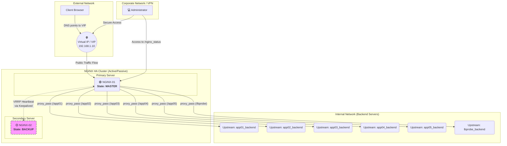

# NGINX HA Cluster Configuration with Advanced Load Balancing

This document details the complete configuration for a High Availability (HA) NGINX cluster in an Active/Passive model, using **Keepalived** for automatic failover.

The configuration includes advanced load balancing rules:

  * **Session Persistence**: Ensures that a user is always directed to the same backend server.
  * **Weighted Load Balancing**: Distributes more traffic to the servers of more critical applications.
  * **Passive Health Checks**: Automatically removes a server from the load balancing pool after 5 connection failures and adds it back once the service normalizes.

-----

## Architecture Diagram

The diagram below illustrates the traffic flow, from the client to the backend applications, through the NGINX HA cluster.



-----

## Step 1: NGINX Configuration

This file must be **identical on both NGINX servers** (NGINX-01 and NGINX-02). It contains the routing logic, load balancing, and passive health checks.

**File:** `/etc/nginx/conf.d/mydomain.conf`

```nginx
# --- Upstreams (Backend Server Pools) ---
#
# Directives used:
# least_conn: Sends new requests to the server with the fewest active connections.
# sticky cookie: Ensures a client remains on the same server during their session (requires extra module).
# max_fails=5: Marks a server as unavailable after 5 failed connection attempts.
# fail_timeout=30s: After being marked as unavailable, NGINX will not try to connect to it for 30 seconds.
#                   After this time, it gradually starts receiving traffic again.
# weight: Defines the traffic priority for each application.

upstream app01_backend {
    least_conn;
    sticky cookie srv_id expires=1h domain=.mydomain.com path=/app01/;
    server 192.168.1.101:5000 weight=4 max_fails=5 fail_timeout=30s;
    server 192.168.1.102:5000 weight=4 max_fails=5 fail_timeout=30s;
    server 192.168.1.103:5000 weight=4 max_fails=5 fail_timeout=30s;
    server 192.168.1.104:5000 weight=4 max_fails=5 fail_timeout=30s;
}

upstream app02_backend {
    least_conn;
    sticky cookie srv_id expires=1h domain=.mydomain.com path=/app02/;
    server 192.168.1.101:5001 weight=4 max_fails=5 fail_timeout=30s;
    server 192.168.1.102:5001 weight=4 max_fails=5 fail_timeout=30s;
    server 192.168.1.103:5001 weight=4 max_fails=5 fail_timeout=30s;
    server 192.168.1.104:5001 weight=4 max_fails=5 fail_timeout=30s;
}

upstream app03_backend {
    least_conn;
    sticky cookie srv_id expires=1h domain=.mydomain.com path=/app03/;
    server 192.168.1.101:5002 weight=3 max_fails=5 fail_timeout=30s;
    server 192.168.1.102:5002 weight=3 max_fails=5 fail_timeout=30s;
    server 192.168.1.103:5002 weight=3 max_fails=5 fail_timeout=30s;
    server 192.168.1.104:5002 weight=3 max_fails=5 fail_timeout=30s;
}

upstream app04_backend {
    least_conn;
    sticky cookie srv_id expires=1h domain=.mydomain.com path=/app04/;
    server 192.168.1.101:5003 weight=2 max_fails=5 fail_timeout=30s;
    server 192.168.1.102:5003 weight=2 max_fails=5 fail_timeout=30s;
    server 192.168.1.103:5003 weight=2 max_fails=5 fail_timeout=30s;
    server 192.168.1.104:5003 weight=2 max_fails=5 fail_timeout=30s;
}

upstream app05_backend {
    least_conn;
    sticky cookie srv_id expires=1h domain=.mydomain.com path=/app05/;
    server 192.168.1.101:5004 weight=1 max_fails=5 fail_timeout=30s;
    server 192.168.1.102:5004 weight=1 max_fails=5 fail_timeout=30s;
    server 192.168.1.103:5004 weight=1 max_fails=5 fail_timeout=30s;
    server 192.168.1.104:5004 weight=1 max_fails=5 fail_timeout=30s;
}

upstream lbprobe_backend {
    least_conn;
    server 192.168.1.101:5006;
    server 192.168.1.102:5006;
    server 192.168.1.103:5006;
    server 192.168.1.104:5006;
}

# --- Server Block ---
server {
    listen 80;
    server_name www.mydomain.com;
    return 301 https://$host$request_uri;
}

server {
    listen 443 ssl http2;
    server_name www.mydomain.com;

    ssl_certificate /etc/nginx/ssl/mydomain.pem;
    ssl_certificate_key /etc/nginx/ssl/mydomain.pem;
    ssl_password_file /etc/nginx/ssl/ssl_pass.txt;
    ssl_protocols TLSv1.2 TLSv1.3;
    ssl_prefer_server_ciphers on;
    ssl_ciphers 'ECDHE-ECDSA-AES128-GCM-SHA256:ECDHE-RSA-AES128-GCM-SHA256';
    proxy_set_header Host $host;
    proxy_set_header X-Real-IP $remote_addr;
    proxy_set_header X-Forwarded-For $proxy_add_x_forwarded_for;
    proxy_set_header X-Forwarded-Proto $scheme;

    # --- Application Routing ---
    location /app01/ { proxy_pass http://app01_backend; }
    location /app02/ { proxy_pass http://app02_backend; }
    location /app03/ { proxy_pass http://app03_backend; }
    location /app04/ { proxy_pass http://app04_backend; }
    location /app05/ { proxy_pass http://app05_backend; }
    location /lbprobe/ { proxy_pass http://lbprobe_backend; }

    # --- Block for the Status Page ---
    location /nginx_status {
        stub_status;
        allow 10.0.0.0/8;
        allow 192.168.0.5;
        deny all;
    }
}
```

-----

## Step 2: Keepalived Configuration for HA

Install Keepalived on both NGINX servers (`sudo apt install keepalived` or `sudo yum install keepalived`).

#### **1. NGINX Check Script**

Create this script on **both servers**. Keepalived will use it to ensure the NGINX process is active. If it's not, it will initiate a failover.

This content should be saved in the file `/etc/keepalived/check_nginx.sh` on **both** servers. Then, make it executable with `sudo chmod +x /etc/keepalived/check_nginx.sh`.

```bash
#!/bin/bash
# Checks if the NGINX process exists
if pgrep nginx > /dev/null; then
    exit 0 # Success, NGINX is running
else
    exit 1 # Failure, NGINX is not running
fi
```

Make the script executable: `sudo chmod +x /etc/keepalived/check_nginx.sh`

-----

### **2. Keepalived Configuration - NGINX-01 Server (MASTER)**

This content should be saved in the file `/etc/keepalived/keepalived.conf` only on the **NGINX-01 (MASTER) server**.

**File:** `/etc/keepalived/keepalived.conf`

```nginx
# Global definitions block
global_defs {
   router_id NGINX_MASTER
}

# Script to monitor NGINX
vrrp_script check_nginx {
    script "/etc/keepalived/check_nginx.sh"
    interval 2  # Run every 2 seconds
    weight 50   # Add 50 to the priority if the script is successful
}

# VRRP instance to manage the Virtual IP
vrrp_instance VI_1 {
    state MASTER                # This is the PRIMARY server
    interface ens160            # IMPORTANT: Change to your network interface (e.g., eth0)
    virtual_router_id 51        # Must be the same on both servers
    priority 150                # The highest priority becomes MASTER

    advert_int 1                # VRRP advertisements every 1 second

    authentication {
        auth_type PASS
        auth_pass your_secret_password # Change and use the same password on both servers
    }

    # The Virtual IP (VIP) that will be shared
    virtual_ipaddress {
        192.168.1.10/24         # IMPORTANT: Change to the desired VIP
    }

    # Associate the monitoring script
    track_script {
        check_nginx
    }
}
```

-----

### **3. Keepalived Configuration - NGINX-02 Server (BACKUP)**

This content should be saved in the file `/etc/keepalived/keepalived.conf` only on the **NGINX-02 (BACKUP) server**.

**File:** `/etc/keepalived/keepalived.conf`

```nginx
# Global definitions block
global_defs {
   router_id NGINX_BACKUP
}

# Script to monitor NGINX (identical to MASTER)
vrrp_script check_nginx {
    script "/etc/keepalived/check_nginx.sh"
    interval 2
    weight 50
}

# VRRP instance to manage the Virtual IP
vrrp_instance VI_1 {
    state BACKUP                # This is the SECONDARY server
    interface ens160            # IMPORTANT: Must be the same interface as the MASTER
    virtual_router_id 51        # Must be the same as the MASTER
    priority 100                # Lower priority makes it a BACKUP

    advert_int 1

    authentication {
        auth_type PASS
        auth_pass your_secret_password # Must be the same password as the MASTER
    }

    # The same Virtual IP as the MASTER
    virtual_ipaddress {
        192.168.1.10/24
    }

    track_script {
        check_nginx
    }
}
```

After creating the files, start and enable the Keepalived service on both servers:

```bash
sudo systemctl start keepalived
sudo systemctl enable keepalived
```
