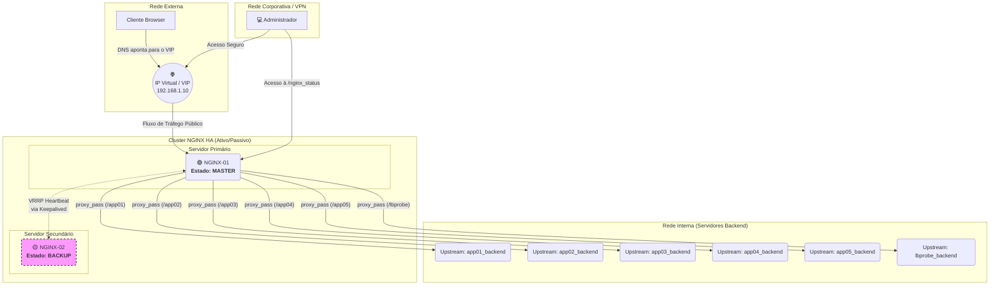

# Configuração de Cluster NGINX HA com Balanceamento e Status

Este documento detalha a configuração completa para um cluster de NGINX em Alta Disponibilidade (HA) no modelo Ativo/Passivo, utilizando **Keepalived** para failover automático e o módulo **Stub Status** para monitoramento básico.

A configuração inclui:
* **Alta Disponibilidade**: Failover automático entre dois servidores NGINX.
* **Persistência de Sessão**: Mantém o usuário no mesmo servidor backend.
* **Balanceamento por Peso**: Prioriza aplicações mais críticas.
* **Health Checks Passivos**: Remove e reintegra backends com falha automaticamente.
* **Página de Status**: Uma interface simples para monitorar a saúde do NGINX.

---

## Diagrama da Arquitetura

O diagrama foi atualizado para incluir o acesso restrito do administrador à página de status.



---

## Passo 1: Configuração do NGINX

Este arquivo deve ser **idêntico em ambos os servidores NGINX**. A principal mudança é a adição de um novo bloco `location /nginx_status`.

**Arquivo:** `/etc/nginx/conf.d/mydomain.conf`

```nginx
# --- Upstreams (Pools de Servidores Backend) ---
# ... (Nenhuma alteração nos blocos upstream. Eles permanecem os mesmos da versão anterior) ...
upstream app01_backend {
    least_conn;
    sticky cookie srv_id expires=1h domain=.mydomain.com path=/app01/;
    server 192.168.1.101:5000 weight=4 max_fails=5 fail_timeout=30s;
    server 192.168.1.102:5000 weight=4 max_fails=5 fail_timeout=30s;
    server 192.168.1.103:5000 weight=4 max_fails=5 fail_timeout=30s;
    server 192.168.1.104:5000 weight=4 max_fails=5 fail_timeout=30s;
}

upstream app02_backend {
    least_conn;
    sticky cookie srv_id expires=1h domain=.mydomain.com path=/app02/;
    server 192.168.1.101:5001 weight=4 max_fails=5 fail_timeout=30s;
    server 192.168.1.102:5001 weight=4 max_fails=5 fail_timeout=30s;
    server 192.168.1.103:5001 weight=4 max_fails=5 fail_timeout=30s;
    server 192.168.1.104:5001 weight=4 max_fails=5 fail_timeout=30s;
}

upstream app03_backend {
    least_conn;
    sticky cookie srv_id expires=1h domain=.mydomain.com path=/app03/;
    server 192.168.1.101:5002 weight=3 max_fails=5 fail_timeout=30s;
    server 192.168.1.102:5002 weight=3 max_fails=5 fail_timeout=30s;
    server 192.168.1.103:5002 weight=3 max_fails=5 fail_timeout=30s;
    server 192.168.1.104:5002 weight=3 max_fails=5 fail_timeout=30s;
}

upstream app04_backend {
    least_conn;
    sticky cookie srv_id expires=1h domain=.mydomain.com path=/app04/;
    server 192.168.1.101:5003 weight=2 max_fails=5 fail_timeout=30s;
    server 192.168.1.102:5003 weight=2 max_fails=5 fail_timeout=30s;
    server 192.168.1.103:5003 weight=2 max_fails=5 fail_timeout=30s;
    server 192.168.1.104:5003 weight=2 max_fails=5 fail_timeout=30s;
}

upstream app05_backend {
    least_conn;
    sticky cookie srv_id expires=1h domain=.mydomain.com path=/app05/;
    server 192.168.1.101:5004 weight=1 max_fails=5 fail_timeout=30s;
    server 192.168.1.102:5004 weight=1 max_fails=5 fail_timeout=30s;
    server 192.168.1.103:5004 weight=1 max_fails=5 fail_timeout=30s;
    server 192.168.1.104:5004 weight=1 max_fails=5 fail_timeout=30s;
}

upstream lbprobe_backend {
    least_conn;
    server 192.168.1.101:5006;
    server 192.168.1.102:5006;
    server 192.168.1.103:5006;
    server 192.168.1.104:5006;
}

# --- Bloco do Servidor ---

server {
    listen 80;
    server_name [www.mydomain.com](https://www.mydomain.com);
    return 301 https://$host$request_uri;
}

server {
    listen 443 ssl http2;
    server_name [www.mydomain.com](https://www.mydomain.com);

    # ... (Configurações SSL e Headers permanecem as mesmas) ...
    ssl_certificate /etc/nginx/ssl/mydomain.pem;
    ssl_certificate_key /etc/nginx/ssl/mydomain.pem;
    ssl_password_file /etc/nginx/ssl/ssl_pass.txt;
    ssl_protocols TLSv1.2 TLSv1.3;
    ssl_prefer_server_ciphers on;
    ssl_ciphers 'ECDHE-ECDSA-AES128-GCM-SHA256:ECDHE-RSA-AES128-GCM-SHA256';
    proxy_set_header Host $host;
    proxy_set_header X-Real-IP $remote_addr;
    proxy_set_header X-Forwarded-For $proxy_add_x_forwarded_for;
    proxy_set_header X-Forwarded-Proto $scheme;

    # --- Roteamento das Aplicações ---
    location /app01/ { proxy_pass http://app01_backend; }
    location /app02/ { proxy_pass http://app02_backend; }
    location /app03/ { proxy_pass http://app03_backend; }
    location /app04/ { proxy_pass http://app04_backend; }
    location /app05/ { proxy_pass http://app05_backend; }
    location /lbprobe/ { proxy_pass http://lbprobe_backend; }

    # --- [NOVO] Bloco para a Página de Status ---
    location /nginx_status {
        stub_status; # Ativa a página de status
        allow 10.0.0.0/8;      # Permite acesso da sua rede interna/VPN
        allow 192.168.0.5;     # Permite acesso de um IP de admin específico
        deny all;              # Bloqueia todos os outros acessos
    }
}
```

### O que a Página de Status Exibe?

Ao acessar `https://www.mydomain.com/nginx_status` de um IP permitido, você verá algo como:

```
Active connections: 291
server accepts handled requests
 16630948 16630948 31070465
Reading: 6 Writing: 179 Waiting: 106
```

* **Active connections**: O número total de conexões ativas.
* **accepts**: Total de conexões aceitas.
* **handled**: Total de conexões gerenciadas (geralmente igual a `accepts`).
* **requests**: Total de requisições de clientes.
* **Reading**: Conexões onde o NGINX está lendo o cabeçalho da requisição.
* **Writing**: Conexões onde o NGINX está escrevendo a resposta de volta para o cliente.
* **Waiting**: Conexões inativas aguardando uma nova requisição (keep-alive).

---

## Passo 2: Configuração do Keepalived para HA

A configuração do Keepalived **não precisa de nenhuma alteração**. Ela continua a mesma, pois sua função é apenas verificar se o processo do NGINX está de pé e gerenciar o IP Virtual.

* Script `/etc/keepalived/check_nginx.sh` (em ambos os servidores)
* Arquivo `/etc/keepalived/keepalived.conf` (versões MASTER e BACKUP)

Ambos permanecem exatamente como na documentação anterior.

---

## Conclusão

Com esta adição, você não tem um "manager" completo, mas ganha uma ferramenta de diagnóstico vital e de baixo custo. Para monitoramento mais avançado com NGINX Community, o próximo passo seria usar uma ferramenta externa (como Zabbix, Prometheus ou Datadog) que colete os dados dessa página `/nginx_status` e os exiba em gráficos históricos.
